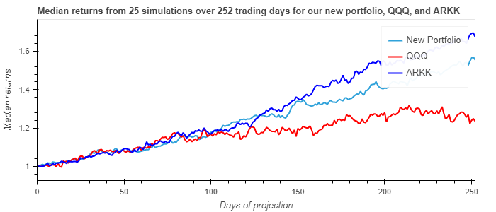
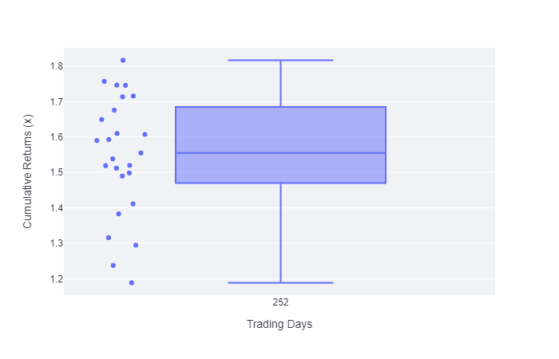

# portfolio_management
This repository is for stocks and bonds portfolio analysis and management

# Portfolio Analyzer: new application that helps investor manage their portfolio

Porfolio analyzer is a fintech application that helps in analyzing performance of porfolios.  In our initial iteration, we are retrieving Cathie Wood's ARKK holdings via API, analyzing risk, return and projection metrics vs. the QQQ index, and then allowing the user to interactively drop or replace stocks within the portfolio to see how it would impact performance.
 

The current project is the inital design and development of the application to get MVP that can be tested on the current market cycle.

# etf_analysis
An application to dissect an etf to analyze both the individual stocks and the fund as a whole's performance metrics utilizing SQL, Python and the Voila library.

## Technologies

In this project we are utilizing Python 3, Jupyter Lab, Pandas, and Numpy.  We also leverage Monte Carlo Simulations for performance projections, plotly for enhanced visualizations, Streamlit for visualizations and the Alpaca and ARKK APIs for stock retrieval data.

Pandas library -- Incredibly useful Python library for data science and data analysis  
Jupyter Lab -- Robust environment to be able to view and edit devopment projects in a streamlined system.  
hvPlot -- A high-level plotting API for the PyData ecosystem built on HoloViews.
SQLAlchemy -- The Database Toolkit for Python *To be used in future iterations*
Voila -- Voilà allows you to convert a Jupyter Notebook into an interactive dashboard that allows you to share your work with others. *To be used in future iterations*  
Numpy -- The fundamental package for scientific computing with Python.  
Streamlit -- A free tool to easily and quickly generate interactive web apps from a python script.
Alpaca API -- a very useful API to retrieve historical stock data, paper trade, and many other options

---

## Installation Guide

* Pandas -- The source code is currently hosted on GitHub at: https://github.com/pandas-dev/pandas

Binary installers for the latest released version are available at the Python Package Index (PyPI) and on Conda.

### conda
`conda install pandas`
### or PyPI
`pip install pandas`

* Jupyter Lab -- 
    [Link for detailed instructions on installing Jupyter Lab here.](https://jupyter.org/install)  
    
*  The PyViz Ecosystem (visualization package that includes hvPlot)  
  *Note that in order for the Streamlit visualization package to work, Bokeh version 2.4.1 must be installed as part of this package*  

### conda
`conda install -c pyviz hvplot`
### or PyPI
`pip install pyviz`  

**For more detailed information on pyviz installation and other features, please reference the [pyviz website](https://pyviz.org/)

* Voila --  

### Voilà can be installed with the mamba or conda package manager:

`mamba install -c conda-forge voila`  -- *To be used in future iterations*

### or from PyPI:

`pip install voila`  

**For more information about Voila, visit their Github repository [here](https://github.com/voila-dashboards/voila)  

* SQLAlchemy -- *To be used in future iterations* 

**For information regarding installation of SQLAlchemy, visit their docs website [here](https://docs.sqlalchemy.org/en/14/intro.html#installation)  
**Their GitHub Repository can be found [here](https://github.com/sqlalchemy/sqlalchemy)  

* Numpy --  

**For information about downloading, installation, and full documentation, visit their website [here](https://numpy.org/) or their GitHub Repository [here](https://github.com/numpy/numpy).  

* Streamlit --  

**For installation instructions visit their website [here](https://docs.streamlit.io/library/get-started/installation)

---
## Dependencies:  

import pandas as pd  
import requests  
import numpy as np  
from alpaca_trade_api.rest import TimeFrame, URL  
import alpaca_trade_api as tradeapi  
import datetime as dt  
import holoviews as hv  
import panel as pn  
import utils.MonteCarloFunctions as mcf  
import utils.AlpacaFunctions as apf  
from utils.updated_analysis import runUpdatedAnalysis
import datetime as dt  
import hvplot
import hvplot.pandas  
import matplotlib.pyplot as plt
import plotly as pty  
import plotly.express as px
import bokeh  
import streamlit as st

## Usage

### There are two facets to the initial version of this application -- the first is a jupyter notebook that contains our intial codebase as well as visualizations and commentary on the code.  The second is our initial_analyses.py which is run with Streamlit that provides enhanced visualizations as well as interactivity to engage with portfolio exploration.  The root directory for the application is the /portfolio_analyzer folder**  

### Jupyter Notebook  

In order to run the jupypter notebook portion of the application, simply create a Jupyter server and access the project_initial.ipynb file in the main directory.  Once in the notebook, each cell can be run to get a drilldown view of the codebase and its core functionality.  

### Streamlit
In order to maximize the full features of the application, a Streamlit server should be engaged as follows --  

*From the terminal:*  

`streamlit run initial_analyses.py`  -- Ensure that you are in the root directory where this file is located and that you have installed the streamlit library before running the command.  

**If you encounter difficulties running Streamlit, possible server errors are discussed [here](https://docs.streamlit.io/knowledge-base/deploy/remote-start).  Their reference docs on the main site cover an extensive amount of questions as well.**

**The basic flow of the application is as follows** --  

1.  ARKK's current holdings are accessed from the [ARKK holdings API](https://arkfunds.io/api/v2/etf/holdings), and then filtered to display tickers, weights and company names.  These holdings are then passed to the Alpaca API to retrieve historical price data.  

2.  Once ARKK's current holdings have been imported, initial analyses are run on the portfolio to assess risk, return and projection metrics vs. the QQQ index.  

3.  After these initial analyses have been ran, via Streamlit the user can choose to drop or exchange stocks within the portfolio to assess how its performance would be affected.  These results are overlayed with the initial ones for comparison and analysis purposes.  

4.  Once all analyses have been run, the user can continue to engage with the app to try out different portfolio combinations to optimize their desired risk and return dynamics.  Below are examples from the Streamlit rendering providing an example of the app's functionality --  

### A comparison of the simulated returns for the initial ARKK portfolio, QQQ, and an updated portfolio after exchanging stocks --  

  

### A distribution chart illustrating returns from a new simulated portfolio --  

  

###  A stacked bar chart with standard deviation and sharpe ratios --  

  

In future iterations we plan to expand on the functionality to allow for more manipulation of not only the ARKK portfolio but others as well, engage with SQLAlchemy to provide database flexibility and potentially even make suggestions for stock additions / exchanges that would optimize a portfolio based on a users risk tolerance, etc.

  

Licensed under the [MIT License](https://github.com/git/git-scm.com/blob/main/MIT-LICENSE.txt)  Copyright 2021 Dave Thomas, Stephen Miyumo, Anthony Hall.